<h1 align="center">Welcome to Maze Solver Visualizer 👋</h1>
<p>
  <a href="https://github.com/HadiZakiAlQattan/maze-solver-visualizer/actions?query=workflow%3ACI">
  </a>
  <a href="https://www.codacy.com?utm_source=github.com&amp;utm_medium=referral&amp;utm_content=HadiZakiAlQattan/maze-solver-visualizer&amp;utm_campaign=Badge_Grade"></a>
  <a href="https://www.python.org/">
  </a>
  <a href="https://docutils.sourceforge.io/rst.html">
  </a>
  <a href="https://github.com/psf/black">
  </a>
  <a href="https://github.com/HadiZakiAlQattan/maze-solver-visualizer/blob/master/LICENSE" target="_blank">
    
  </a>
</p>

> Maze solver visualizer, solving with A*, BFS, DFS algorithms include steps show and distance report.

# Algorithms

<details>
<summary> 
<a href="https://github.com/HadiZakiAlQattan/maze-solver-visualizer/tree/master/src/algorithms/a_star.py">A*</a>
</summary>

<h1 lang="en">A* search algorithm</h1>
<p>
A* (pronounced "A-star") is a graph traversal and path search algorithm, which is often used in computer science due to its completeness, optimality, and optimal efficiency. One major practical drawback is its {\displaystyle O(b^{d})}O(b^d) space complexity, as it stores all generated nodes in memory. Thus, in practical travel-routing systems, it is generally outperformed by algorithms which can pre-process the graph to attain better performance, as well as memory-bounded approaches; however, A* is still the best solution in many cases.
</p>
<h2>Description</h2>
<p>
A* is an informed search algorithm, or a best-first search, meaning that it is formulated in terms of weighted graphs: starting from a specific starting node of a graph, it aims to find a path to the given goal node having the smallest cost (least distance travelled, shortest time, etc.). It does this by maintaining a tree of paths originating at the start node and extending those paths one edge at a time until its termination criterion is satisfied.

At each iteration of its main loop, A* needs to determine which of its paths to extend. It does so based on the cost of the path and an estimate of the cost required to extend the path all the way to the goal. Specifically, A* selects the path that minimizes

<h3><b>f(n)=g(n)+h(n)</b></h3>

where n is the next node on the path, g(n) is the cost of the path from the start node to n, and h(n) is a heuristic function that estimates the cost of the cheapest path from n to the goal. A* terminates when the path it chooses to extend is a path from start to goal or if there are no paths eligible to be extended. The heuristic function is problem-specific. If the heuristic function is admissible, meaning that it never overestimates the actual cost to get to the goal, A* is guaranteed to return a least-cost path from start to goal.

Typical implementations of A* use a priority queue to perform the repeated selection of minimum (estimated) cost nodes to expand. This priority queue is known as the open set or fringe. At each step of the algorithm, the node with the lowest f(x) value is removed from the queue, the f and g values of its neighbors are updated accordingly, and these neighbors are added to the queue. The algorithm continues until a goal node has a lower f value than any node in the queue (or until the queue is empty). The f value of the goal is then the cost of the shortest path, since h at the goal is zero in an admissible heuristic.

The algorithm described so far gives us only the length of the shortest path. To find the actual sequence of steps, the algorithm can be easily revised so that each node on the path keeps track of its predecessor. After this algorithm is run, the ending node will point to its predecessor, and so on, until some node's predecessor is the start node.

As an example, when searching for the shortest route on a map, h(x) might represent the straight-line distance to the goal, since that is physically the smallest possible distance between any two points.

If the heuristic h satisfies the additional condition h(x) ≤ d(x, y) + h(y) for every edge (x, y) of the graph (where d denotes the length of that edge), then h is called monotone, or consistent. With a consistent heuristic, A* is guaranteed to find an optimal path without processing any node more than once and A* is equivalent to running Dijkstra's algorithm with the reduced cost d'(x, y) = d(x, y) + h(y) − h(x).
</p>
<h2>Pseudocode</h2>
<p>
The following pseudocode describes the algorithm :
</p>

```shell
function reconstruct_path(cameFrom, current)
total_path := {current}
while current in cameFrom.Keys:
    current := cameFrom[current]
    total_path.prepend(current)
return total_path

// A* finds a path from start to goal.
// h is the heuristic function. h(n) estimates the cost to reach goal from node n.
function A_Star(start, goal, h)
    // The set of discovered nodes that may need to be (re-)expanded.
    // Initially, only the start node is known.
    // This is usually implemented as a min-heap or priority queue rather than a hash-set.
    openSet := {start}
    
    // List of nodes already discovered and explored. 
    // Starts off empty
    // Once a node has been 'current' it then goes here
    closeSet :={}   


    // For node n, cameFrom[n] is the node immediately preceding it on the cheapest path from start
    // to n currently known.
    cameFrom := an empty map

    // For node n, gScore[n] is the cost of the cheapest path from start to n currently known.
    gScore := map with default value of Infinity
    gScore[start] := 0

    // For node n, fScore[n] := gScore[n] + h(n). fScore[n] represents our current best guess as to
    // how short a path from start to finish can be if it goes through n.
    fScore := map with default value of Infinity
    fScore[start] := h(start)

    while openSet is not empty
        // This operation can occur in O(1) time if openSet is a min-heap or a priority queue
        current := the node in openSet having the lowest fScore[] value
        if current = goal
            return reconstruct_path(cameFrom, current)

        // Current node goes into the closed set
        closeSet.add(current)

        openSet.Remove(current)
        for each neighbor of current
            // d(current,neighbor) is the weight of the edge from current to neighbor
            // tentative_gScore is the distance from start to the neighbor through current
            tentative_gScore := gScore[current] + d(current, neighbor)
            if tentative_gScore < gScore[neighbor]
                // This path to neighbor is better than any previous one. Record it!
                cameFrom[neighbor] := current
                gScore[neighbor] := tentative_gScore
                fScore[neighbor] := gScore[neighbor] + h(neighbor)
                if neighbor not in closeSet
                    openSet.add(neighbor)

    // Open set is empty but goal was never reached
    return failure
```

<hr>
<p>
This article uses material from the Wikipedia article
<a href="https://en.wikipedia.org/wiki/A*_search_algorithm">"A* search algorithm"</a>, which is released under the <a href="https://creativecommons.org/licenses/by-sa/3.0/">Creative Commons Attribution-Share-Alike License 3.0</a>.
</p>

</details>

<details>
<summary> 
<a href="https://github.com/HadiZakiAlQattan/maze-solver-visualizer/tree/master/src/algorithms/bfs.py">BFS</a>
</summary>

<h1 lang="en">Breadth-first search</h1>
<p>
Breadth-first search (BFS) is an algorithm for traversing or searching tree or graph data structures. It starts at the tree root (or some arbitrary node of a graph, sometimes referred to as a 'search key'), and explores all of the neighbor nodes at the present depth prior to moving on to the nodes at the next depth level.

It uses the opposite strategy as depth-first search, which instead explores the node branch as far as possible before being forced to backtrack and expand other nodes.
</p>

<h2>Pseudocode</h2>
<p>
Input: A graph Graph and a starting vertex root of Graph

Output: Goal state. The parent links trace the shortest path back to root
</p>

```shell
1  procedure BFS(G, start_v) is
2      let Q be a queue
3      label start_v as discovered
4      Q.enqueue(start_v)
5      while Q is not empty do
6          v := Q.dequeue()
7          if v is the goal then
8              return v
9          for all edges from v to w in G.adjacentEdges(v) do
10             if w is not labeled as discovered then
11                 label w as discovered
12                 w.parent := v
13                 Q.enqueue(w)
```

<hr>
<p>
This article uses material from the Wikipedia article
<a href="https://en.wikipedia.org/wiki/Breadth-first_search">"Breadth-first search"</a>, which is released under the <a href="https://creativecommons.org/licenses/by-sa/3.0/">Creative Commons Attribution-Share-Alike License 3.0</a>.
</p>

</details>

<details>
<summary> 
<a href="https://github.com/HadiZakiAlQattan/maze-solver-visualizer/tree/master/src/algorithms/dfs.py">DFS</a>
</summary>

<h1 lang="en">Depth-first search</h1>
<p>
Depth-first search (DFS) is an algorithm for traversing or searching tree or graph data structures. The algorithm starts at the root node (selecting some arbitrary node as the root node in the case of a graph) and explores as far as possible along each branch before backtracking.
</p>

<h2>Pseudocode</h2>
<p>
Input: A graph G and a vertex v of G

Output: All vertices reachable from v labeled as discovered

A recursive implementation of DFS:
</p>

```shell
procedure DFS(G, v) is
    label v as discovered
    for all directed edges from v to w that are in G.adjacentEdges(v) do
        if vertex w is not labeled as discovered then
            recursively call DFS(G, w)
```

<p>
The order in which the vertices are discovered by this algorithm is called the lexicographic order.

A non-recursive implementation of DFS with worst-case space complexity O(|E|):
</p>

```shell
procedure DFS-iterative(G, v) is
    let S be a stack
    S.push(v)
    while S is not empty do
        v = S.pop()
        if v is not labeled as discovered then
            label v as discovered
            for all edges from v to w in G.adjacentEdges(v) do 
                S.push(w)
```

<p>
These two variations of DFS visit the neighbors of each vertex in the opposite order from each other: the first neighbor of v visited by the recursive variation is the first one in the list of adjacent edges, while in the iterative variation the first visited neighbor is the last one in the list of adjacent edges. The recursive implementation will visit the nodes from the example graph in the following order: A, B, D, F, E, C, G. The non-recursive implementation will visit the nodes as: A, E, F, B, D, C, G.

The non-recursive implementation is similar to breadth-first search but differs from it in two ways:

- it uses a stack instead of a queue, and
- it delays checking whether a vertex has been discovered until the vertex is popped from the stack rather than making this check before adding the vertex.
</p>

<hr>
<p>
This article uses material from the Wikipedia article
<a href="https://en.wikipedia.org/wiki/Depth-first_search">"Depth-first search"</a>, which is released under the <a href="https://creativecommons.org/licenses/by-sa/3.0/">Creative Commons Attribution-Share-Alike License 3.0</a>.
</p>

</details>

# Demo 🧮

<details>
    <summary> General records </summary>

## A* algorithm (show steps -> enabled)


## Change the theme and hide the grid

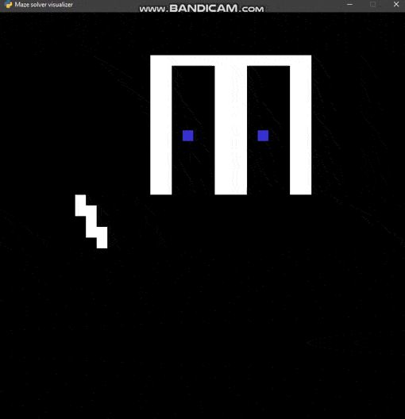

## All algorithms (show steps -> enabled)

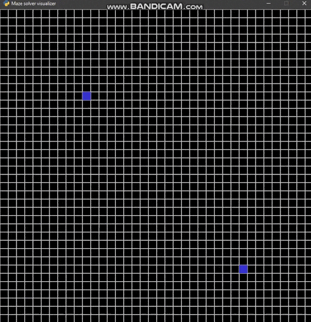

## All algorithms (onlty A* show steps -> enabled)

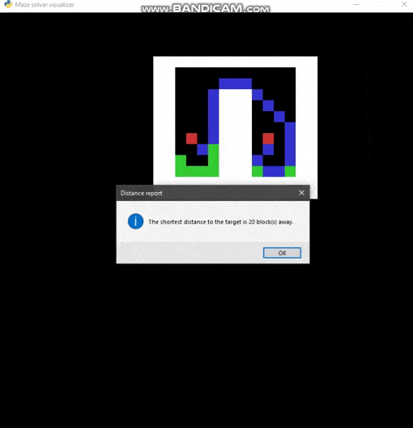

## BFS algorithm (show steps -> enabled)

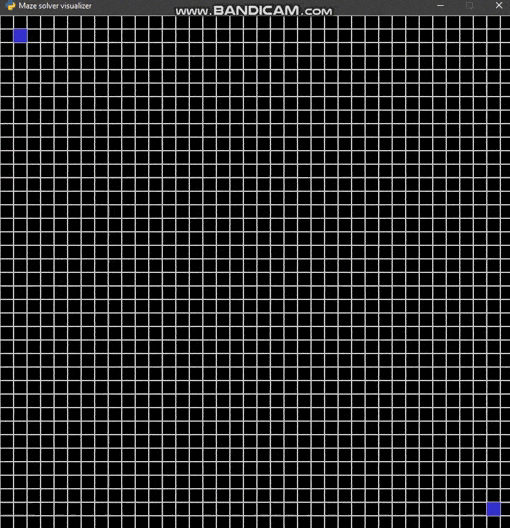

</details>

<details>
    <summary> Moving start / target position </summary>

## Moving start position ( drag & drop )

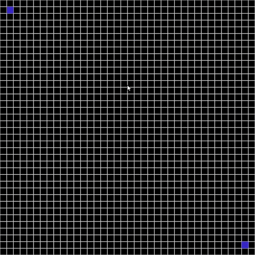

</details>

<details>
    <summary> Drawing the maze </summary>
    
## Shortcuts

|Shortcut|Description|
|:---:|:---:|
|e|enable / disable the eraser|

## Normal drawing

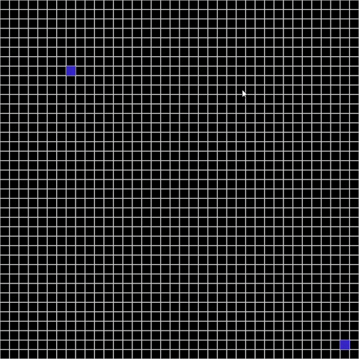

## Erasing ( e )

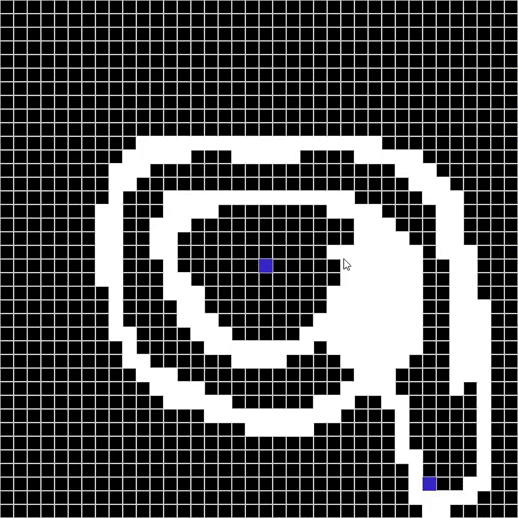

</details>

<details>
    <summary> Configuration dialog and distance report </summary>

## Shortcuts

|Shortcut|Description|
|:---:|:---:|
|enter|show configuration dialog to start searching|

## Configuration dialog ( enter )

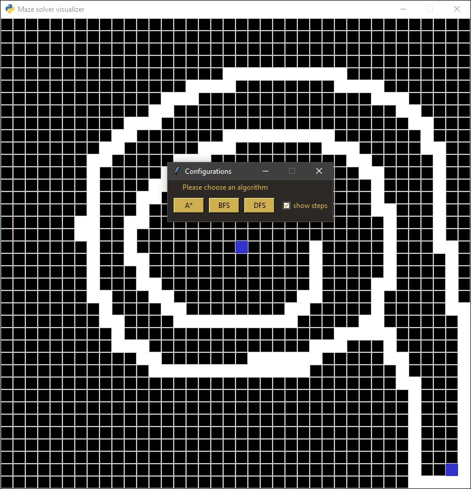

## Enabled show steps


## Distance report

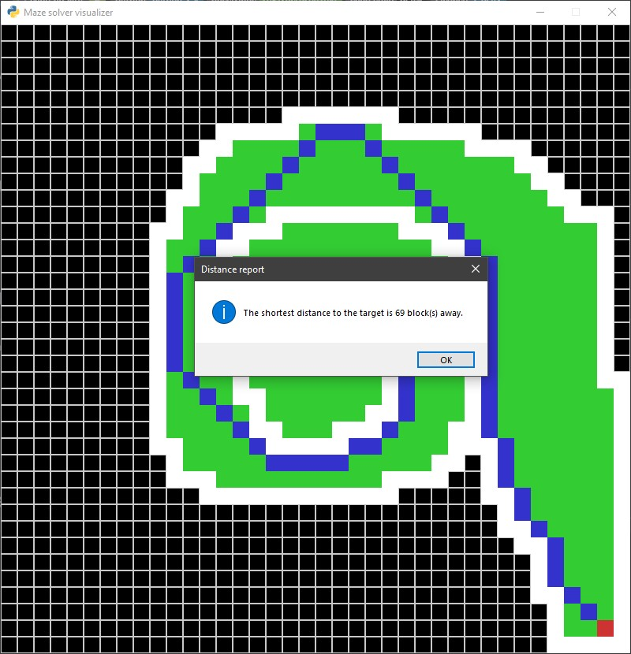

## No solution case

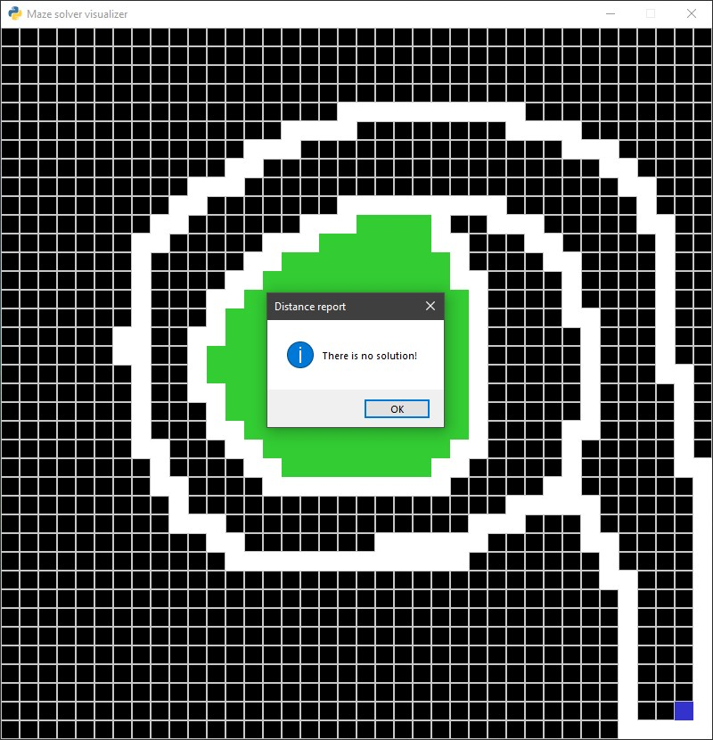

</details>

<details>
    <summary> Reset </summary>


|Shortcut|Description|
|:---:|:---:|
|delete|reset everything|
|backspace|reset everything|
|spacebar|reset everything except walls|

## Reset everything ( delete | backspace )

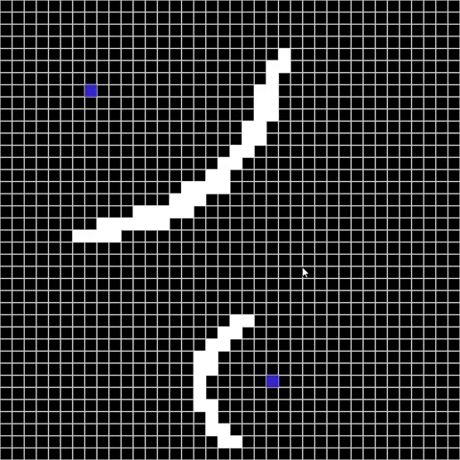

## Reset everything except walls ( spacebar )

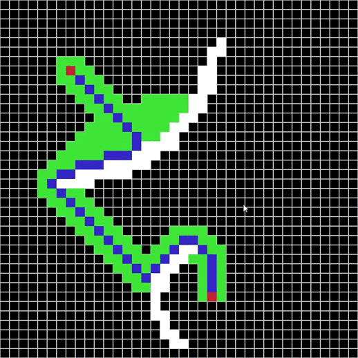

</details>

<details>
    <summary> Themes </summary>

## Shortcuts

|Shortcut|Description|Default|
|:---:|:---:|:---:|
|t|change screen theme (dark / light)|dark|
|s|(show / hide) screen grid|show grid|

## Changing the theme and showing/hiding the grid ( t | s )

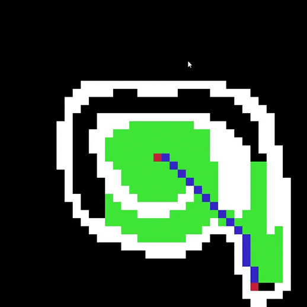

## Dark theme with grid ( t )

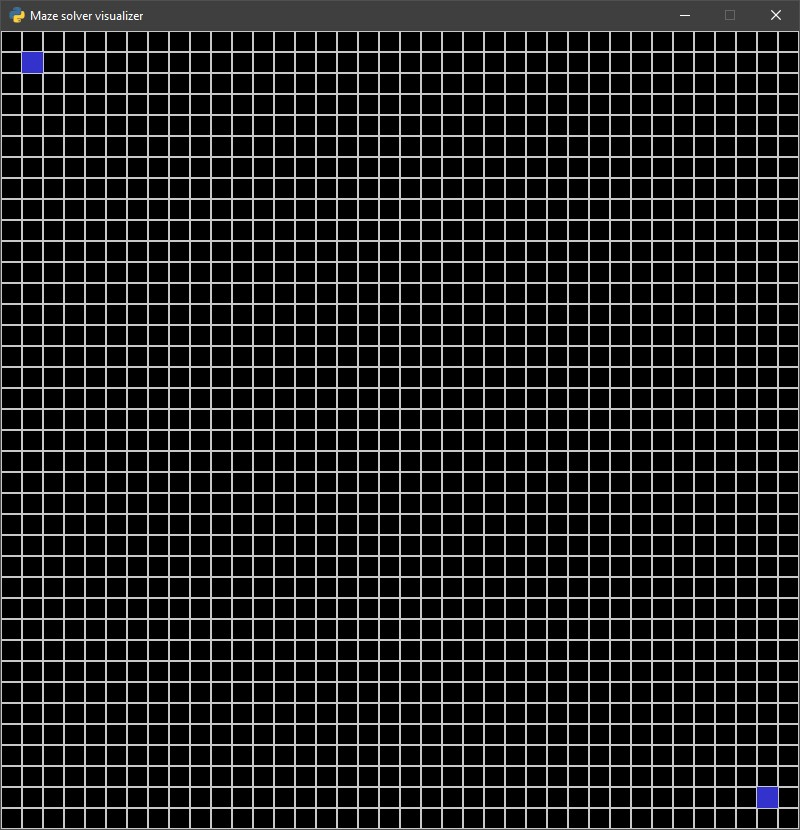

## Dark theme without grid ( s )

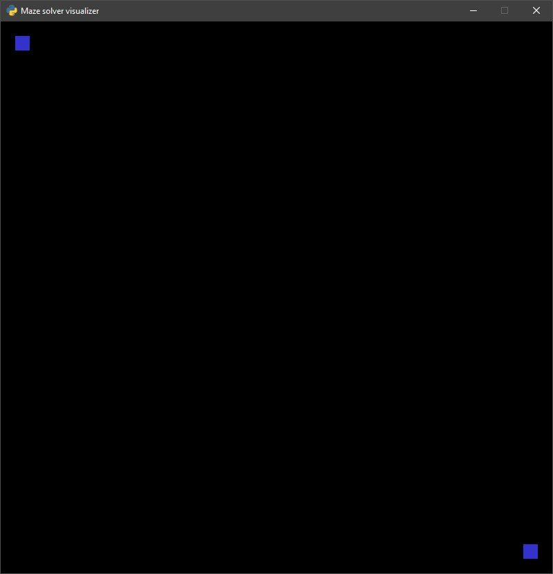

## Light theme with grid ( t )

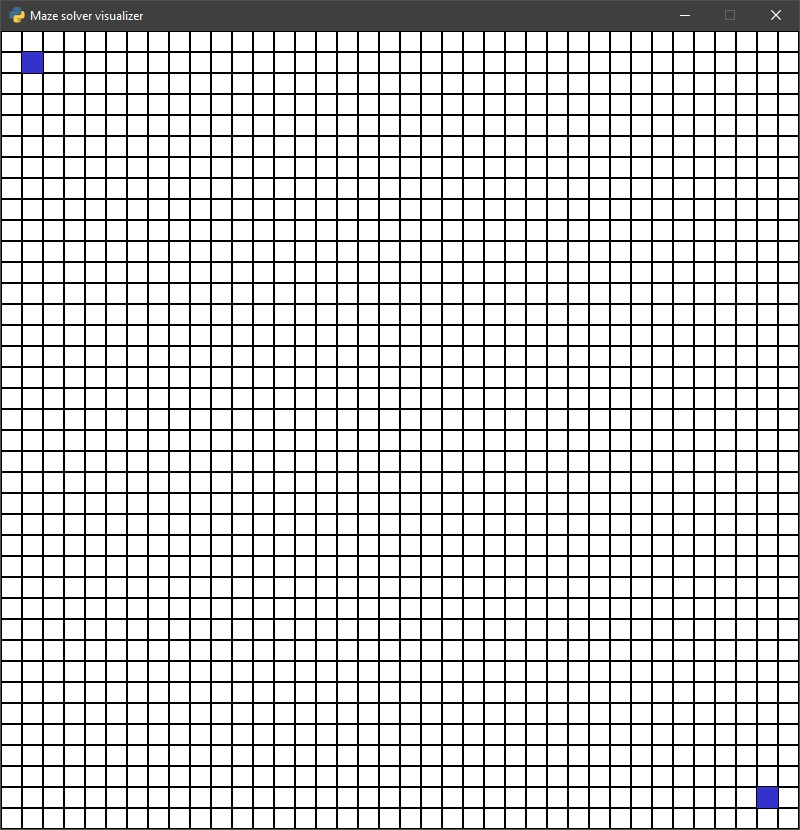

## Light theme without grid ( s )


</details>

# Usage 🗝
### There are two ways to use this project:
* Without any prerequisites (Windows OS) :
    
    <details>
    <summary> show instructions </summary>

    + download whole [executable directory](https://github.com/HadiZakiAlQattan/maze-solver-visualizer/tree/master/executable)
    + run [executable/maze_solver_visualizer.exe](https://github.com/HadiZakiAlQattan/maze-solver-visualizer/tree/master/executable/exe/maze_solver_visualizer.exe)
    </details>

* With prerequisites (Unix-based OS) : 
  
  <details>
  <summary> show instructions </summary>

    + clone this repo : 
        ```shell 
        $ git clone https://github.com/HadiZakiAlQattan/maze-solver-visualizer.git
        ```
    + Install prerequisites :
        * [Python 3.x](https://www.python.org/downloads/)
        * Python libraries from [requirements.txt](https://github.com/HadiZakiAlQattan/maze-solver-visualizer/blob/master/requirements.txt)
            ```shell 
            $ sudo pip3 install -r requirements.txt
            ```

    + Run [run.sh](https://github.com/HadiZakiAlQattan/maze-solver-visualizer/blob/master/run.sh) : 
        ```shell
        $ ./run.sh
        ```
  </details>

# Tests 🧪

### Unit tests @ [tests directory](https://github.com/HadiZakiAlQattan/maze-solver-visualizer/tree/master/tests) includes tests only for :
* [Datastructures](https://github.com/HadiZakiAlQattan/maze-solver-visualizer/tree/master/src/datastructures)
* [Algorithms](https://github.com/HadiZakiAlQattan/maze-solver-visualizer/tree/master/src/algorithms)

### Run command :
``` shell
$ ./run.sh tests
```

# Copyright ©

👤 **Hadi Zaki AlQattan**

* Github: [@HadiZakiAlQattan](https://github.com/HadiZakiAlQattan)
* Email: <alqattanhadizaki@gmail.com>

📝 **License**

Copyright © 2020 [Hadi Zaki AlQattan](https://github.com/HadiZakiAlQattan).<br />
This project is [GPLv3](https://github.com/HadiZakiAlQattan/maze-solver-visualizer/blob/master/LICENSE) licensed.

***
Give a ⭐️ if this project helped you!
